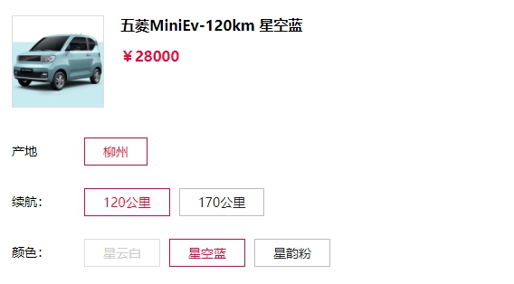

## 简介
`goods-attr` 是一款极易上手的 商品多规格属性选择器 组件。
- 基于质数的特性开发，实现原理简单
- 支持 IE9(含) 以上浏览器，0 依赖
- 各属性名称支持自定义
- 聚合成功后支持当前页面异步处理，也支持跳转处理

> 暂不支持 Vue, React

## 在线演示
[DEMO](https://codepen.io/luochongfei/pen/eYgbWzp)

## 安装使用
[查看](https://github.com/luochongfei/goods-attr/examples/index.html)

## 参数文档
[查看](https://github.com/luochongfei/goods-attr/examples/config.html)

## License
MIT
